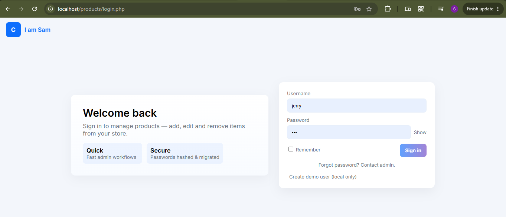
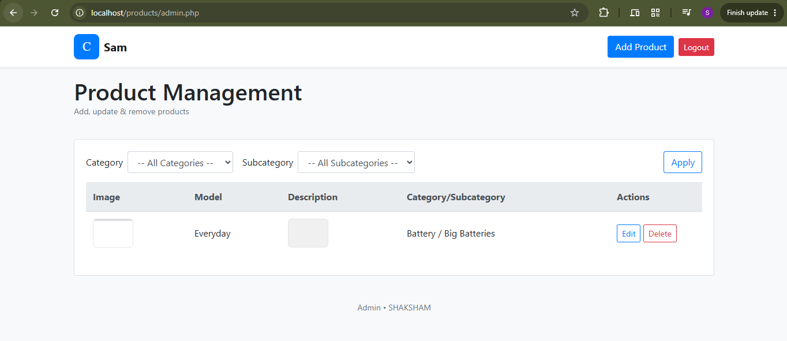
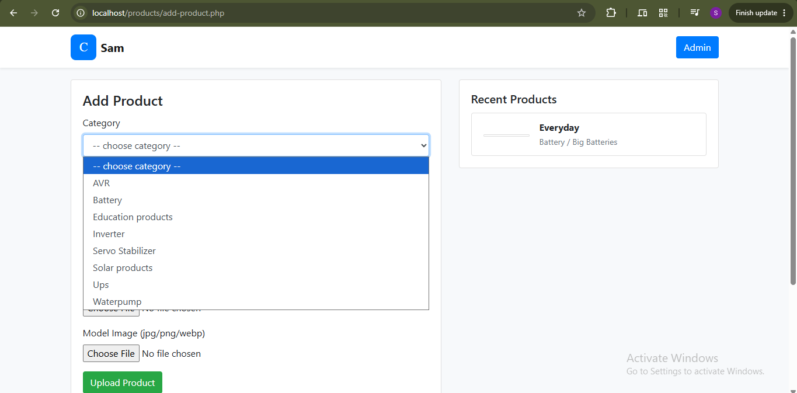
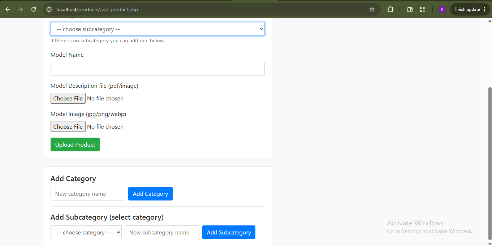
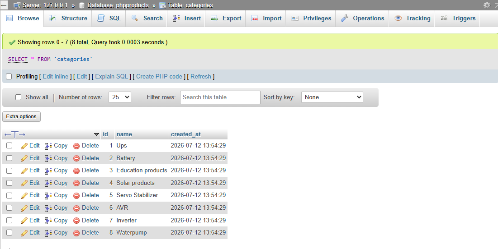
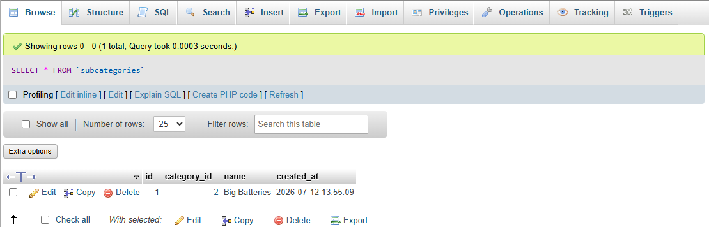
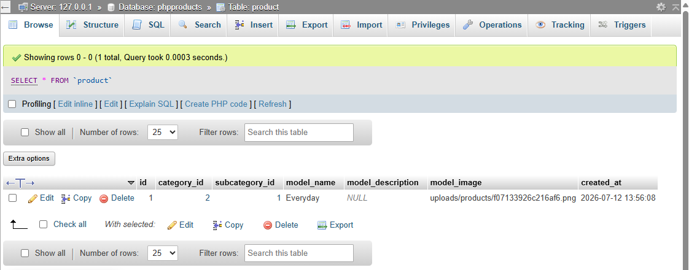
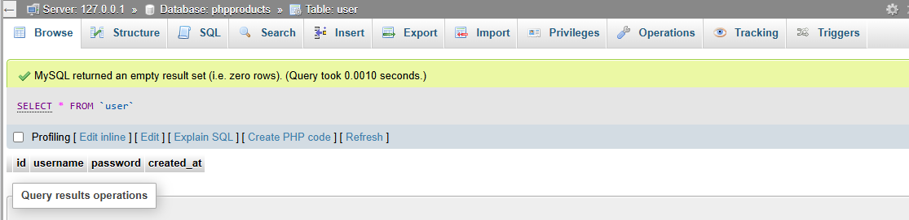

# Product Management Interface (PHP)

A web-based Product Management System built using **PHP** and **MySQL** that allows administrators to manage products, categories, and subcategories through an intuitive dashboard.

## Features

- User Authentication (Login/Logout)
- Product Management
  - Add Products
  - Edit Products
  - Delete Products
- Category Management
  - Add Categories
  - View Categories
- Subcategory Management
  - Add Subcategories
  - Dynamic Category-wise Subcategory Selection
- Product Image Upload
- Product Description File Upload (PDF/Image)
- Filter Products by Category and Subcategory
- Responsive Admin Dashboard
- MySQL Database Integration

---

## Tech Stack

- PHP
- MySQL
- HTML5
- CSS3
- Bootstrap 4
- JavaScript
- XAMPP (Local Development)

---

## Project Structure

```
products/
│
├── uploads/
│   └── products/
│
├── admin.php
├── add-product.php
├── edit-product.php
├── delete.php
├── login.php
├── connect.php
│
└── README.md
```

---

## Database

Database Name:

```
phpproducts
```

Tables Used:

- user
- categories
- subcategories
- product

---

## Installation

### 1. Clone Repository

```bash
git clone https://github.com/yourusername/product-management-system.git
```

### 2. Move Project

Copy the project into:

```
C:\xampp\htdocs\
```

### 3. Start XAMPP

Start:

- Apache
- MySQL

### 4. Create Database

Open:

```
http://localhost/phpmyadmin
```

Create a database named:

```
phpproducts
```


### 5. Configure Database

Update `connect.php`

```php
$servername = "localhost";
$username = "root";
$password = "";
$database = "phpproducts";
```

### 6. Run Project

```
http://localhost/products/
```

# Important: 
```
1. Create the user table first in order to sign in.
2. Begin the project with "http://localhost/products/add-product.php" so that the database gets configured with required tables.
```

---

## Screenshots


### Login Page



### Admin Dashboard



### Add Product



### Product Details



### Categories Table



### Subcategories Table



### Product Table



### User Table



---

## Functionalities

### Authentication

- Secure Login
- Logout

### Product Module

- Upload Product Image
- Upload Product Description File
- Edit Product Details
- Delete Product
- Display Recent Products

### Category Module

- Create Categories
- Create Subcategories
- Dynamic Dropdown Filtering

### Product Filter

- Filter by Category
- Filter by Subcategory

---

## Future Improvements

- Product Search
- Pagination
- Multiple Image Upload
- User Roles
- Dashboard Analytics
- Password Encryption (bcrypt)
- REST API Integration

---

## Author

**Shaksham**

Computer Science Engineering Graduate

GitHub:
https://github.com/shaksham10
